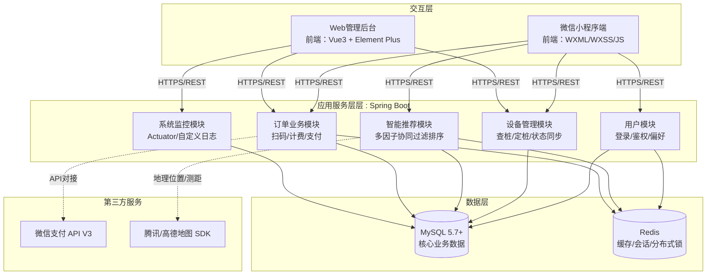
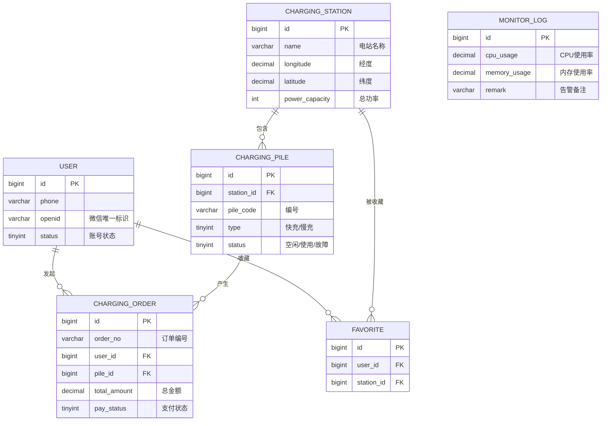

# 智能充电桩推荐系统 - 详细设计与架构文档

## 1. 系统架构图 (System Architecture)

基于前后端分离的思想，系统分为交互层、网关层（可选，使用Nginx）、应用层、数据层以及第三方服务。



## 2. 数据库 ER 图 (Entity-Relationship Diagram)

根据规格说明书以及之前生成的 `schema.sql`，系统的核心业务实体及其关系如下：



## 3. 核心算法设计 (多因子智能推荐算法)

按照需求规格说明书 (F-USER-02)，推荐算法采用**多因子加权模型**，公式如下：

$$ Score = W_1 \times N(Distance) + W_2 \times N(Idle) + W_3 \times N(Price) + W_4 \times N(Preference) $$

- **$W_1$ (距离权重 = 30%)**：距离越近，得分越高。归一化公式：$N(Distance) = 1 - (实际距离 / 最大搜索半径)$。
- **$W_2$ (空闲率权重 = 40%)**：空闲枪数越多，得分越高。归一化公式：$N(Idle) = 空闲桩数量 / 总桩数量$。
- **$W_3$ (电价权重 = 20%)**：电价越便宜，得分越高。取当前时段电价对比周边平均电价进行归一化。
- **$W_4$ (偏好权重 = 10%)**：基于用户历史充电习惯（如偏好快充、曾收藏过该站点等）给出的基础分数加成。

## 4. 原型图与UI布局设计 (UI Prototype)

### 4.1 用户端 (微信小程序) - 首页地图与推荐
```text
+---------------------------------------+
|             微信小程序标题栏          |
+---------------------------------------+
| [搜索地点/充电站]              [图标] |
+---------------------------------------+
|                                       |
|             ( 腾讯/高德地图 SDK )     |
|                                       |
|                     [📍 站A(空3)]    |
|       [👱我的定位]                    |
|                                       |
|  [📍 站B(空0)]                        |
+---------------------------------------+
| ⬇️ 智能推荐 (上拉列表)                 |
| 1. 星光谷充电站 (推荐指数: 95分)      |
|    距您1.2km | 快充4空, 慢充2空 | 1.2元 |
|    [ 导航去这里 ]                     |
| 2. 软件园地下充电站 (推荐指数: 88分)  |
|    距您0.8km | 快充0空, 慢充5空 | 1.5元 |
|    [ 导航去这里 ]                     |
+---------------------------------------+
| (扫码充电)                (我的主页)  |
+---------------------------------------+
```

### 4.2 管理端 (Web后台) - 订单监控看板
```text
+-------------------------------------------------------------+
| 充电桩后台管理系统      [超级管理员] [退出]                 |
+----------------+--------------------------------------------+
| 菜单           |  [ 仪表盘 ] > 今日概况                     |
| 📊 监控大屏    |                                            |
| ⚡ 站点管理    |  [今日订单数: 1,024]  [今日营收: ￥23,450] |
| 🔌 电桩管理    |  [异常订单数:      3]  [报警设备:       1] |
| 💰 订单管理    |                                            |
| 👤 用户管理    |  [条件搜索: 桩编号/手机号/日期范围] [查询] |
| ⚠️ 告警监控    |  ---------------------------------------   |
|                |  订单号 | 手机号 | 桩编号 | 金额 | 状态    |
|                |  O001   | 138..  | P1-01  | 25.0 | 已支付  |
|                |  O002   | 139..  | P2-05  | 10.0 | 未支付⚠️|
|                |  [分页: < 1 2 3 >]                         |
+----------------+--------------------------------------------+
```

## 5. 接口设计概述 (API Design)

所有接口统一前缀 `/api/v1`，并在 Header 中传递 `Authorization: Bearer <Token>`。

### 5.1 小程序端
1. `POST /api/v1/user/wxLogin` - 微信登录鉴权，获取Token。
2. `GET /api/v1/station/recommend` - 获取带权重的智能推荐充电站列表 (参数: lng, lat, radius)。
3. `POST /api/v1/order/scan` - 扫码发起充电，生成订单并下发充电指令。
4. `POST /api/v1/order/pay` - 调用微信统一下单，获取支付签名参数。

### 5.2 管理端
1. `GET /api/v1/admin/station/page` - 分页查询充电站管理档案。
2. `PUT /api/v1/admin/pile/{id}/status` - 强制更改充电桩状态（如设为维修中）。
3. `GET /api/v1/admin/sys/monitor` - 获取当前系统CPU、内存等Actuator指标与日志。
